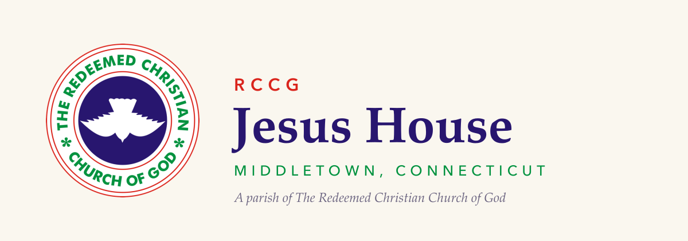
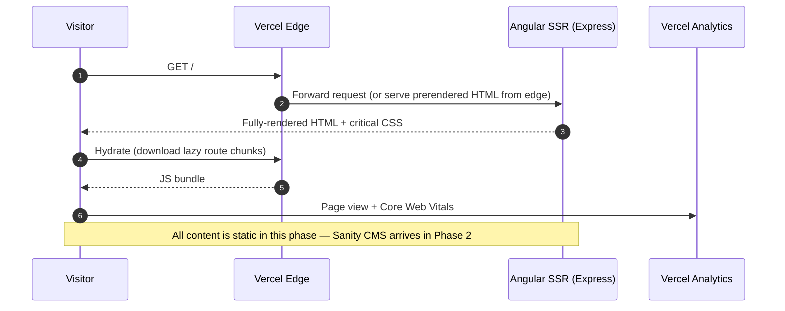

<picture>
  <source media="(prefers-color-scheme: dark)"  srcset="assets/banner-dark.svg">
  <source media="(prefers-color-scheme: light)" srcset="assets/banner-light.svg">
  
</picture>

[](https://github.com/Builder106/jesus-house/actions/workflows/ci.yml)
[](https://angular.dev)
[](https://www.typescriptlang.org/)
[](https://tailwindcss.com)
[](#license)
[](https://jesus-house.vercel.app)

The first-ever website for **RCCG Jesus House, Middletown** — a parish of The Redeemed Christian Church of God at 120 Washington Street, Middletown, CT 06457, a short drive from Wesleyan University. The parish has had no owned web presence at all (no site, no social accounts), so this Angular 22 SSR site becomes its first front door: Sunday service at 9:00 AM, the official RCCG dove seal as the mark, Fraunces + Mulish on a cream ground, and the parish's signature ministry up front — **"Need a ride?"** Every Sunday the parish picks up Wesleyan students for service, and the site digitizes that offer (v1 is a one-tap email/call CTA; the full ride-request form arrives in Phase 3).

## How it works



The current phase is deliberately CMS-free: every page is static Angular, prerendered at build time where possible and SSR'd otherwise. Sanity (a fresh project, separate from the sibling parish's) joins in Phase 2 for announcements, events, and ministry pages.

## Demos

<details>
<summary><strong>Demo recordings pending</strong></summary>

> Demo recordings come from the Gherkin E2E demo suite (Playwright + playwright-bdd narrative video walkthroughs — `npm run test:demo`). They'll appear here as GIFs grouped by user journey once the first recordings are produced.

</details>

## Stack

| Layer | Choice |
|---|---|
| Framework | Angular 22 with `@angular/ssr` (standalone, component prefix `jh`) |
| Styling | Tailwind v4 via `@tailwindcss/postcss` |
| Typography | Fraunces (headings) + Mulish (body/UI), self-hosted via `@fontsource` |
| Unit tests | Vitest via `ng test` |
| E2E | Playwright + playwright-bdd (QA suite + demo-recording suite) |
| Hosting | Vercel — git integration deploys; GitHub Actions gates quality |
| Telemetry | `@vercel/analytics` + `@vercel/speed-insights` |

## Local development

```bash
git clone https://github.com/Builder106/jesus-house.git
cd jesus-house
npm ci
npm start                  # ng serve on :4200 with SSR + HMR
npm run build              # production build + prerender
```

> **`npm test` caveat:** unit tests are verified in CI, not locally — the local checkout path contains parentheses (`My Drive (yvaughan@…)`), which breaks Vitest's glob discovery and reports "No test files found." The tests are fine; trust the CI `unit` job.

See [CONTRIBUTING.md](./CONTRIBUTING.md) for project structure, guardrails, commit-message style, and out-of-scope items.

## Roadmap

- ✅ **Phase 1** — Scaffold + brand shell: Angular 22 SSR, Tailwind v4 tokens, RCCG seal brand kit, Fraunces/Mulish, home page with the "Need a ride?" CTA (mailto/tel)
- ⏳ **Phase 2** — Sanity CMS (new project) + content pages: Plan a Visit ✅ and Wesleyan RCF ✅ shipped as static pages ahead of the CMS; About and Ministries still to come
- ⏳ **Phase 3** — Ride-request form + notifications (serverless handler → email; campus pickup presets)
- ⏳ **Phase 4** — Events, Watch (RCCG streams), Give
- ⏳ **Phase 5** — Launch: website URL on the Google Business listing, claim directory listings, parish domain

## License

[MIT](./LICENSE).
